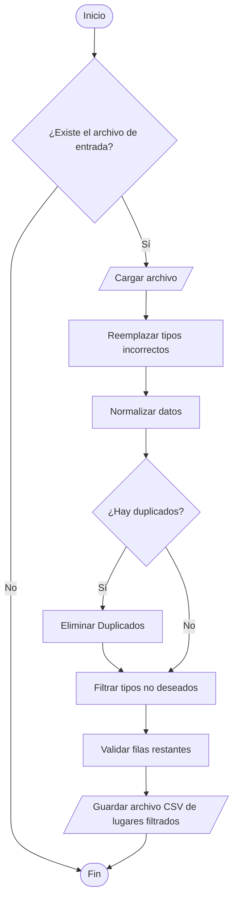

# Diagrama de Fujo perteneciente al script `filterPlacesTypes.py`

```mermaid
flowchart TD
    A(["Inicio"]) --> B{"¿Existe el archivo de entrada?"}
    B -- Sí --> D["Cargar archivo"]
    B -- No --> N(["Fin"])
    D --> C["Reemplazar tipos incorrectos"]
    C --> E["Normalizar datos"]
    E --> G{"¿Hay duplicados?"}
    G -- Sí --> F["Eliminar Duplicados"]
    F --> I["Filtrar tipos no deseados"]
    G -- No --> I
    I --> K["Validar filas restantes"]
    K --> L["Guardar archivo CSV de lugares filtrados"]
    L --> N
    D@{ shape: lean-r}
    L@{ shape: lean-r}
```