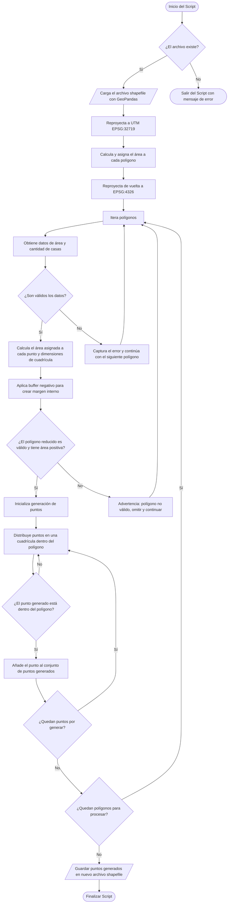

# Diagrama de Fujo perteneciente al script `getSectoralParcels.py`

```mermaid
flowchart TD
    A(["Inicio del Script"]) --> B["¿El archivo existe?"]
    B -- Sí --> C["Carga el archivo shapefile con GeoPandas"]
    B -- No --> D(["Salir del Script con mensaje de error"])
    C --> E["Reproyecta a UTM EPSG:32719"]
    E --> F["Calcula y asigna el área a cada polígono"]
    F --> G["Reproyecta de vuelta a EPSG:4326"]
    G --> H["Itera polígonos"]
    H --> I["Obtiene datos de área y cantidad de casas"]
    J{"¿Son válidos los datos?"} -- Sí --> K["Calcula el área asignada a cada punto y dimensiones de cuadrícula"]
    J -- No --> L["Captura el error y continúa con el siguiente polígono"]
    L --> H
    K --> M["Aplica buffer negativo para crear margen interno"]
    M --> N{"¿El polígono reducido es válido y tiene área positiva?"}
    N -- Sí --> O["Inicializa generación de puntos"]
    N -- No --> P["Advertencia: polígono no válido, omitir y continuar"]
    P --> H
    O --> Q["Distribuye puntos en una cuadrícula dentro del polígono"]
    R{"¿El punto generado está dentro del polígono?"} -- Sí --> S["Añade el punto al conjunto de puntos generados"]
    R -- No --> Q
    S --> T{"¿Quedan puntos por generar?"}
    T -- No --> U{"¿Quedan polígonos para procesar?"}
    U -- Sí --> H
    U -- No --> V["Guardar puntos generados en nuevo archivo shapefile"]
    T -- Sí --> Q
    V --> W(["Finalizar Script"])
    I --> J
    Q --> R
    B@{ shape: diam}
    C@{ shape: lean-r}
    V@{ shape: lean-r}
```